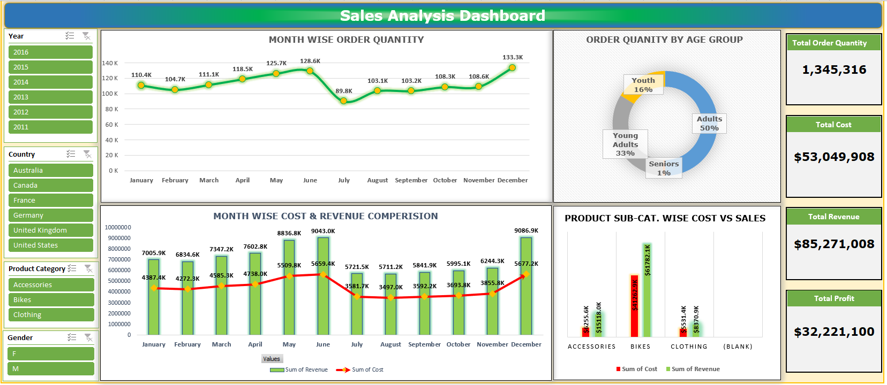

# 📊 Sales Analysis Dashboard (Excel)

## 🔍 Project Overview
This project presents an interactive **Sales Analysis Dashboard** built using Microsoft Excel.  
It analyzes sales performance, customer behavior, and business trends to support data-driven decision-making.

---

## 🛠️ Tools & Techniques
- Microsoft Excel
- Pivot Tables & Pivot Charts
- Data Cleaning & Transformation
- Dashboard Design
- KPI Tracking

---

## 📈 Dashboard Preview

---

## 📊 Key Metrics
- Total Sales
- Revenue Trends Over Time
- Top-Selling Products
- Regional Sales Performance
- Customer Insights

---

## 🔎 Key Insights
- Identified high-performing products contributing to revenue growth  
- Analyzed regional sales differences to uncover opportunities  
- Observed customer purchasing patterns for better targeting  
- Highlighted trends to support forecasting and planning  

---

## 💼 Business Impact
This dashboard enables:
- Faster decision-making through visual insights  
- Identification of growth opportunities  
- Performance tracking across regions and products  
- Improved strategic planning  

---

## 📁 Files Included
- 📄 `sales_dashboard.xlsx` → Interactive Excel dashboard  
- 🖼️ `sales_dashboard.png` → Dashboard preview  

---

## 🚀 Future Improvements
- Automate data updates using Power Query  
- Integrate with Power BI for advanced analytics  
- Add forecasting models  

---

## 📬 Contact
Feel free to connect with me on LinkedIn or GitHub for feedback or collaboration.
